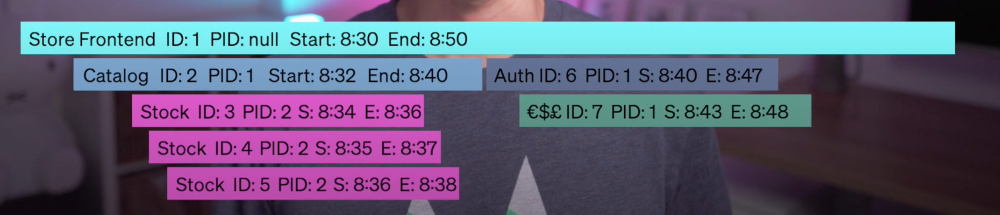

# What is observability?
 From [wikipedia](https://en.wikipedia.org/wiki/Observability):
> Observability is a measure of how well internal states of a system can be inferred from knowledge of its external outputs

Observability means the ability to “see inside” of a system, to no have to infer, to not just gather metrics and aggregate data, but to actually follow the inputs through the system to their respective outputs

More accurately, observability in tech, means distributed tracing, which allows a system to receive a request and track that as it interacts with vary of functions, methods and services

## What's tracing

Traces generally consist of [spans](https://signoz.io/blog/distributed-tracing-span/), that represent those pieces of work, and in nearly all tracing systems, a spam has four pieces of data:

- Span ID
- Parent Span ID
- Start Time
- End Time

> Spans are fundamental building blocks of distributed tracing. A single trace in distributed tracing consists of a series of tagged time intervals known as spans. Spans represent a logical unit of work in completing a user request or transaction.

And often there's some additional metadata to help with search and aggregation. With these four main pieces of data, you can use the spans to reconstruct the exact execution of your system from input to output

In case of problems, such an increase of latency or an error, it makes it much easier to find exact what that is, so we don't to infer it from the metrics we already gathered  

## Tools

Many tracing tools will not only create spans for services but also for instance function or method call within the code being executed

As a tracing tool is evaluated, it's important to know which languages and frameworks are supported so that you can get the most detailed tracing

## Sampling

> Sampling, or downsampling, is reducing the sampling rate of a signal. For example, if you only trace one request for every 100 requests, you are downsampling your tracing.

Sampling is done for the following reasons:

- To reduce the cost of data collection.
- To reduce the size of the collected data.
- To reduce the size of transferred data.

If a service is receiving many requests, and each request is generating dozens or more spans, this could lead to an increase of resource consumption by your application and has ramifications for data transference and storage, so *sampling* is often used to reduce this but it does on the cost of losing or ignoring data
