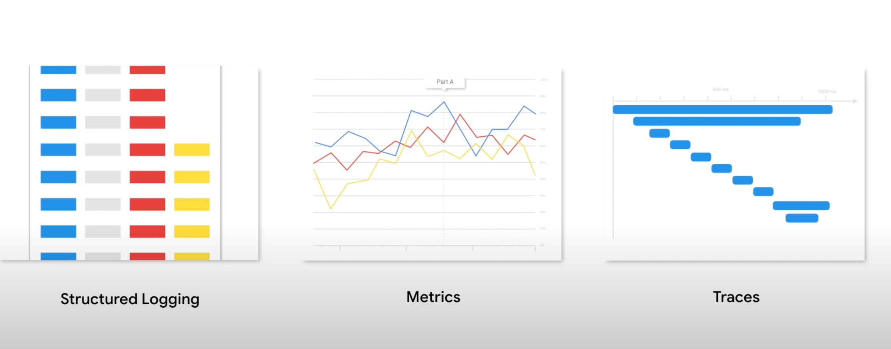
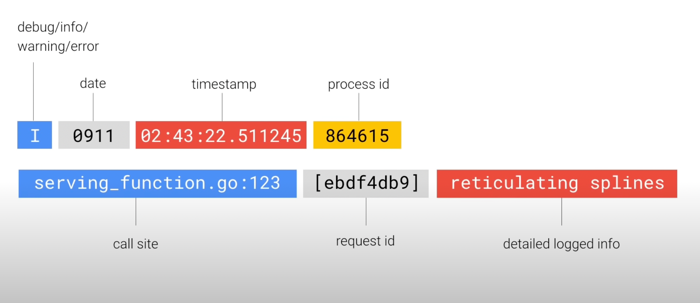
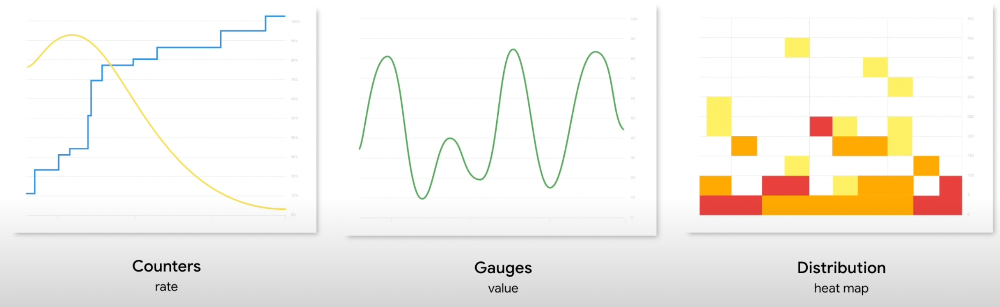
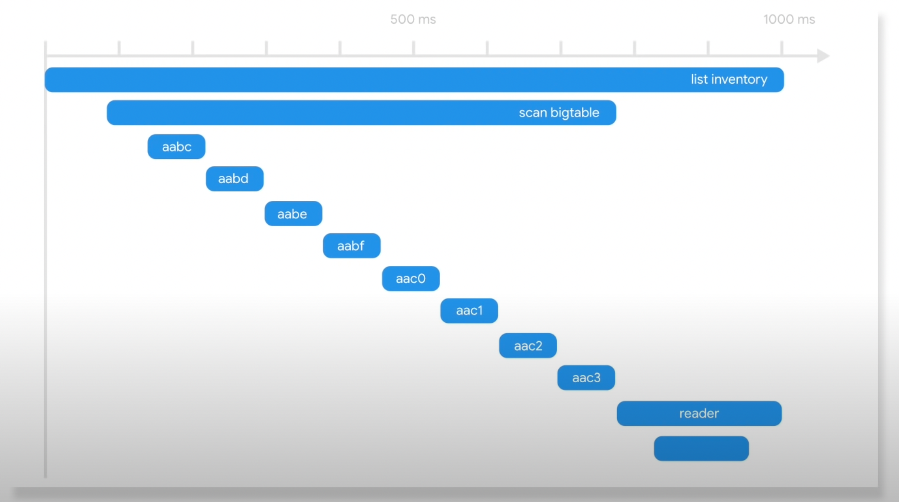
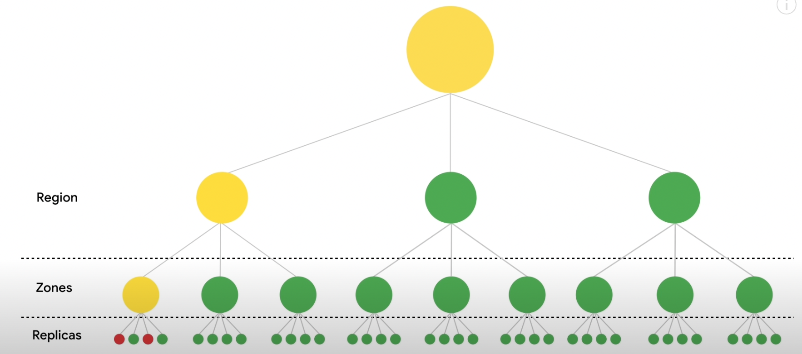

# The 3 key areas

## Structured Logging

Structured logs are omitted by each process and may contain a mix of information, ranging from records of individual users queries to debug information generically associated with a service

Request Logs:

Debug Logs:

## Metrics

Metrics reflect aggregate-type data about the performance of services, such as the numbers of queries, which is a counter, their latencies which is a distribution, and the CPU load, which might be a gauge

## Traces

Tracing allows individual executions flows to be traced to the system, including timing and dependency details 

## How those can help to identify problems?

**Metrics** are used as part of service level indications (SLI), in order to monitor outages that are spending our error budget faster than what it's tolerated

Once there's an indication that something's wrong, it's necessary to discover where in the system it's broken, and if it can be mitigated by draining a zone or specific set of replicas

It might be needed to drill down into the metrics in order to find out what are the commonalities between the slow and erroring queries, for instance, do they have a shared zone, or a shared set of dependencies or maybe a different version of the code that is new and was just rolled out

So **traces** might be used as well to find the interaction between the components that's causing the slower failing queries

And then **logs** to understand each failure in detail

Once you get paged, look at those dashboards in which provided these different metrics with common starting points for queries, such as break down by region, et cetera

And even though you might only get paged on these kind of higher level issues, it's still important to collect information about these lower level issues, which could help to debug the root cause

You'd then need to edit queries to further drill down or get breakdowns intersected with other properties, for instance, the build version or the set of feature flags

You don't necessarily need to alert on every metric you collect, just on the error budget, but having that information available really helps to diagnose problems
