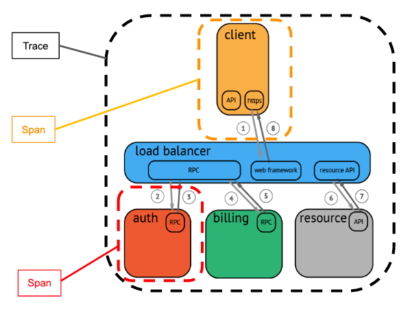
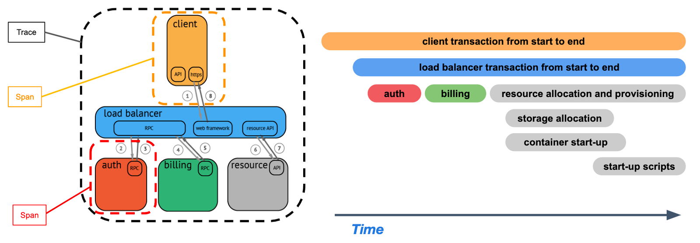
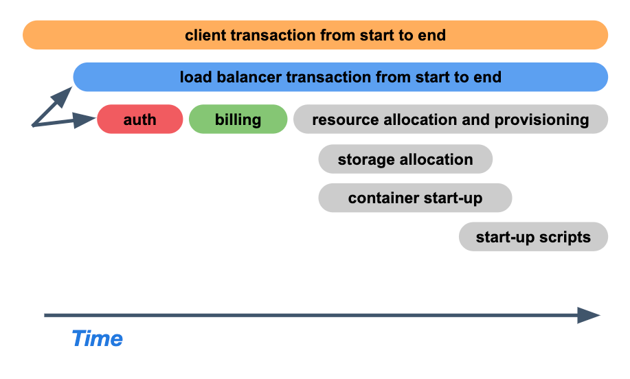

# Spans

## Definition

A single trace in distributed tracing consists of a series of tagged time intervals known as spans

It's a named, timed operation (Generally in milliseconds) that represents a piece of the workflow in the distributed system

<p align="center">


</p>

The visualization of a trace can be similar to a "tree", in which each span reflects the time that execution started and completed 

<p align="center">
  
</p>

Each span has dependencies/relationships between them, therefore the request starts with a root span and it can have multiple child spans, and each of those can also have their own child spans

## Purpose

Spans provide informations about the system execution to observability tools, so it should contain detailed data

The components of an individual span include:
- Operation name
- Start and finish timestamps
- `SpanContext`
- Set of `Attributes`
- Ordered list of `Events`

## Span Components

### SpanContext

The span context is really important in order to build the execution relationships, and each span needs to propagate it's context to it's child

It may be sent within a request to a remote system, or to another span generated by the same system

The context tells the child span who it's parent is (via the `span_ID`) and what trace it belongs to (`trace_ID`)

### Attributes

Attributes provide details about a span by using key-value pairs. They are applied to the whole span and don't include timestamps (`Event` can be used for information about events that happen at a specific time)

It allows to query, group, or analyze traces and spans, which is really important for the core analysis loop in observability, in which you can narrow down your hypothesis 

The [OpenTelemetry Spec](https://github.com/open-telemetry/opentelemetry-specification) defines standard attributes that you should use, for example `StatusCode` and `SpanKind`)

### Status

`Status` is a standardized property, it may be set to values like `OK`, `Cancelled` , and `Permission Defined`

### SpanKind

`SpanKind` is a standardized property. It provides performance context in a trace, answering questions such as: "Does this span call a remote system?", "Does it serve requests from remote systems?", "Does it do work asynchronously off of a queue?" 

The supported values are: `CLIENT`, `SERVER`, `PRODUCER`, `CONSUMER`, `INTERNAL`

### User-Defined

It's possible to create your own attributes key/value pairs so that the information you know you'll need to understand your system are available 

Here are a couple of examples:

- db.type: cassandra
- db.url: mysql://db.example.com:3306
- net.transport: IP.TCP
- net.peer.ip: 127.0.0.1

### Events

`Events` contain a name, a timestamp, and an optional set of `Attributes` 

They represent an event that occurred at a specific time within a span's workload

Here are some examples of events: t:3, name:log, message:“retrieved 400 records” t:5, name:image-generated, image.x:408, image.y:552, image.size:2055 KB

### Span Components Example

````
t=0            operation name: db_query               t=10

     +-----------------------------------------------------+
     | · · · · · · · · · ·    Span     · · · · · · · · · · |
     +-----------------------------------------------------+

Status: Unavailable

Attributes:
- db.instance:"customers"
- db.statement:"SELECT * FROM mytable WHERE foo='bar'"
- peer.address:"mysql://127.0.0.1:3306/customers"

Events:
- (t=4): message:"Can't connect to mysql server on '127.0.0.1'(10061)"

Parent:
  SpanContext:
  - trace_id:"abc123"
  - span_id:"xyz654"

SpanContext:

- trace_id:"abc123"
- span_id:"xyz789"
````
